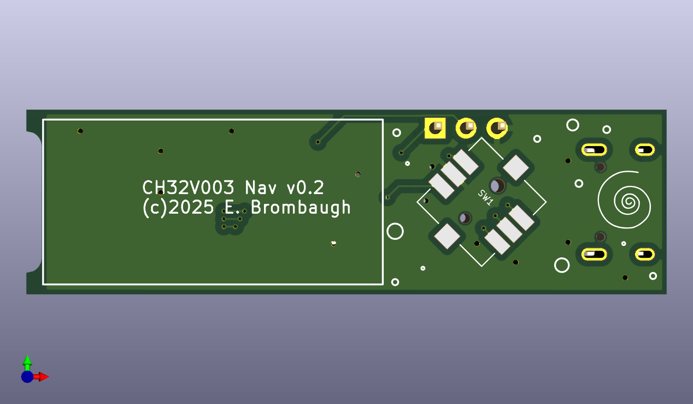
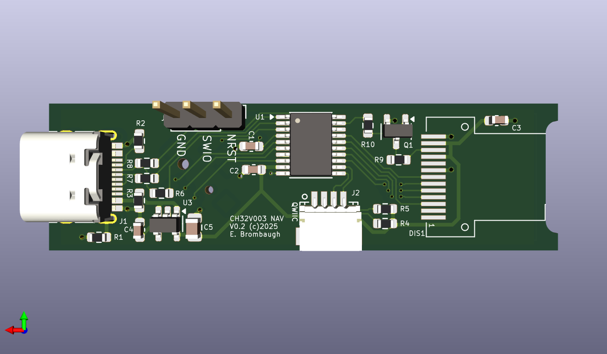
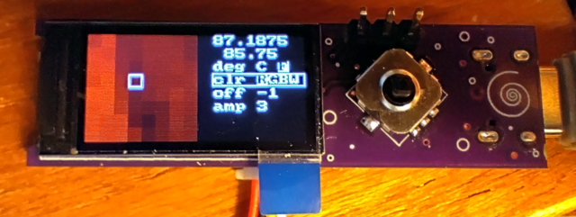
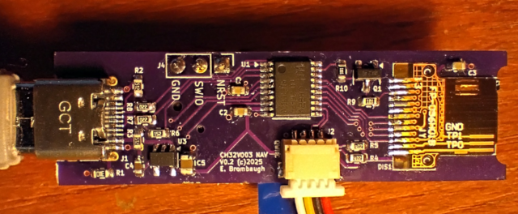

# ch32v003_lcd_nav
A simple CH32V003 board with IPS LCD and navigation switch.

## Abstract
This is a board with the following features:
* CH32V003F4P6 RISC-V MCU in TSSOP20 package
* 160x80 IPS LCD display
* 5-way navigation switch
* USB socket with power and optional low-speed interface
* Qwiic jack for I2C interfacing

